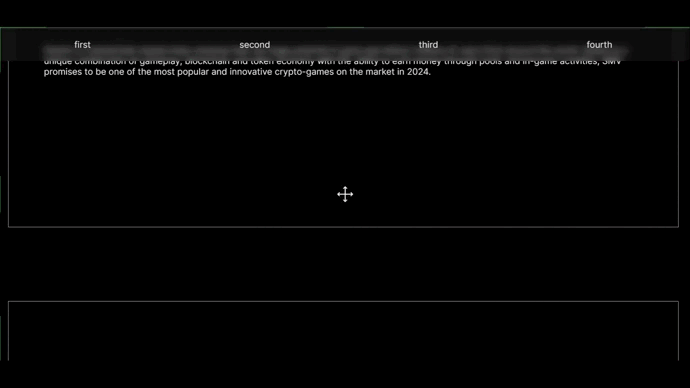
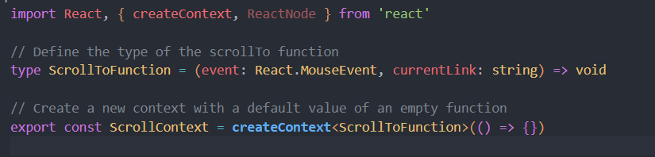
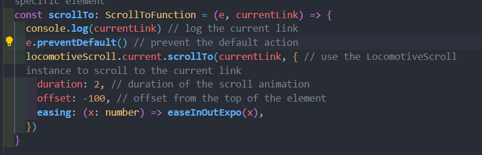
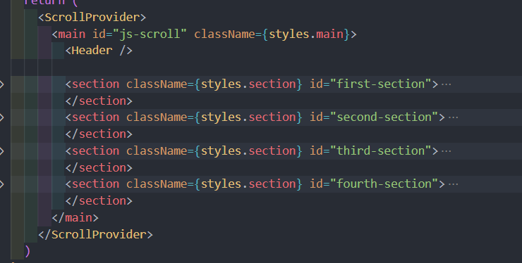

# Next.js Locomotive Anchor Link Scroll #

This is a simple app that demonstrates how to use **Locomotive V5.beta** and **context** in **Next.js** to create smooth scrolling effects for anchor links.

## How to use ##

To use this example, you need to follow these steps:

  - Create a context file called `scrollContext.tsx` that contains the logic for scrolling and exporting the `ScrollContext` object.

  - Create a provider component that wraps your app and provides the `scrollTo` function as a value to the `ScrollContext`. The `scrollTo` function takes an event and a selector as arguments and scrolls to the element that matches the selector.

  - Make sure your whole app is inside the provider component, especially the components that use the scrolling feature. Like that:

  - In the component where you use anchor links, you have to access the `scrollTo` function from the context, like this: `const scrollTo = useContext(ScrollContext)`.

  - Then, in the `<a>` tag, you need to pass the current event and the selector of the target element to the `scrollTo` function, like this: `onClick={(event) => scrollTo(event, '#your_section')`.

  

  **That's it!!!**

  I hope this example helps you to create really smooth apps and improve your customer's experience. Good luck!
